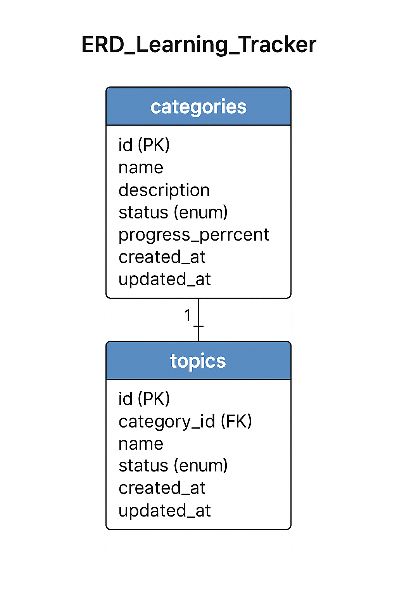

# 🧠 System Design Document (SDD)
### Project: Learning Tracker  
**Author:** Vikash Saini  
**Version:** 1.0  
**Date:** 12-11-2025

---

## 🧭 1. System Overview

The Learning Tracker application is a full-stack web platform that allows users to plan, track, and visualize their learning progress across multiple subjects.
It consists of three main layers:

Frontend: ReactJS (Vite + TailwindCSS)

Backend: Java Spring Boot (REST APIs)

Database: MySQL

During development, the React frontend runs locally using the Vite development server for fast hot reloads, while the Spring Boot API and MySQL database run in Docker Compose containers for environment consistency.
In production, all three components will be fully containerized and deployed on AWS (using either an EC2 instance with Docker Compose or ECS for container orchestration).

---

## 🏗️ 2. High-Level Architecture

During development, the frontend (React) runs locally using Vite’s development server, while the backend (Spring Boot API) and database (MySQL) run inside Docker Compose containers.
The frontend communicates with the backend over REST APIs (http://localhost:8080), and the backend connects to MySQL via Docker’s internal network.

In production, all three components — frontend, backend, and database — will be fully containerized and deployed on AWS using either:

A single EC2 instance with Docker Compose (for MVP), or

AWS ECS (Elastic Container Service) for managed, scalable container orchestration.
---

## ⚙️ 3. Core Components

### 🧩 Frontend (React)
- **Purpose:** Provides the user interface for managing categories and topics.  
- **Responsibilities:**
  - Render dashboard with category tiles and progress indicators.
  - Manage topic lists inside each category.
  - Handle user actions (create, update, import).
  - Communicate with backend REST APIs using Axios.

### ⚙️ Backend (Spring Boot)
- **Purpose:** Acts as the REST API layer and handles business logic.  
- **Responsibilities:**
  - Manage CRUD operations for Categories and Topics.
  - Calculate and update category progress.
  - Propagate status changes automatically.
  - Process Excel uploads for bulk topic creation.

**Modules:**
| Layer | Description |
|--------|--------------|
| Controller | Exposes REST endpoints |
| Service | Contains business logic |
| Repository | Handles DB interactions (Spring Data JPA) |
| Model | Defines entities (Category, Topic) |
| DTO/Mapper | Maps entities ↔ DTOs for clean API responses |

### 💾 Database (MySQL)
- **Purpose:** Persistent storage for all learning data.  
- **Tables:**
  - `categories` — stores name, description, status, progress
  - `topics` — stores name, status, foreign key to category

All database connections and schema creation are handled automatically via JPA.  

---

## 🧱 4. Entity Relationship Diagram (ERD)



---

## 🔗 5. Data Flow Summary

**1. Dashboard Load**
- Frontend calls `/api/categories`
- Backend returns all categories with progress percentage
- React renders category tiles with colors + progress

**2. Add Category**
- POST `/api/categories` → adds category in DB
- Default status = “NOT_STARTED”, progress = 0%

**3. Add / Import Topics**
- POST `/api/topics/category/{categoryId}` or `/api/topics/import`
- Topics created under category, status = “NOT_STARTED”

**4. Update Topic Status**
- PUT `/api/topics/{id}` → updates status
- Backend recalculates category progress and status

**5. Delete Category/Topic**
- DELETE endpoint removes entity and recalculates progress if needed.

---

## 🎯 6. Status and Progress Logic

### Category Status
| Condition | Category Status |
|------------|----------------|
| All topics NOT_STARTED | `NOT_STARTED` |
| At least one topic IN_PROGRESS | `IN_PROGRESS` |
| All topics COMPLETED | `COMPLETED` |

### Progress Calculation
```
progressPercent = (completedTopics / totalTopics) * 100
```
Progress is recalculated automatically whenever a topic is created, deleted, or updated.

---

## 🧾 7. API Overview

| Method | Endpoint | Description |
|--------|-----------|-------------|
| GET | `/api/categories` | Fetch all categories |
| POST | `/api/categories` | Create category |
| PUT | `/api/categories/{id}` | Update category |
| DELETE | `/api/categories/{id}` | Delete category |
| GET | `/api/topics/category/{categoryId}` | Get all topics of a category |
| POST | `/api/topics/category/{categoryId}` | Add topic under category |
| POST | `/api/topics/import/{categoryId}` | Bulk import topics from Excel |
| PUT | `/api/topics/{id}` | Update topic status |
| DELETE | `/api/topics/{id}` | Delete topic |

---

## 🐳 8. Deployment Architecture (Docker Compose)

### Services:
| Service | Image | Ports | Depends On |
|----------|--------|--------|-------------|
| **mysql** | mysql:8 | 3306 | - |
| **api** | custom-built Spring Boot JAR | 8080 | mysql |
| **web** | node:latest (React build) | 5173 | api |

**Command to run all:**
```bash
docker compose up --build
```

---

## 🧠 9. Non-Functional Overview

| Aspect | Requirement |
|--------|--------------|
| Performance | API < 300ms for normal CRUD ops |
| Scalability | Supports hundreds of categories, thousands of topics |
| Reliability | Auto recalculation ensures consistency |
| Modularity | Each service independent and containerized |
| Extensibility | Future addition of “Users” or “Goals” without breaking design |

---

## ✅ 10. Summary

This design defines a clean, scalable, and modular architecture for the **Learning Tracker**.  
It separates responsibilities clearly, uses standard technologies, and ensures automatic status propagation and progress tracking.  
It is production-ready for a single-user or small-team use case and easily expandable for multi-user features in the future.

---

### 🔖 End of SDD (v1.0)
